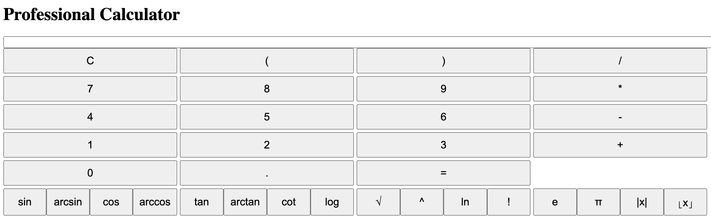

# Calculator

This professional calculator is a versatile JavaScript application designed to perform a wide range of mathematical calculations. To use this calculator, simply execute the 'calculator.html' file in your browser, and you'll have access to the following features:

Basic arithmetic operations: Addition (+), subtraction (-), multiplication (*), and division (/).
Trigonometric functions: Sine (sin), Arcsine (arcsin), Cosine (cos), and Arccosine (arccos).
Additional trigonometric functions: Tangent (tan), Arctangent (arctan), Cotangent (cot), and Logarithm (log).
Mathematical constants: Euler's number (e) and Pi (π).
Advanced operations: Square root (√), exponentiation (^), natural logarithm (ln), and factorial (!).
Absolute value (|x|) and floor value (⌊x⌋) operators for professional use.

This calculator provides a user-friendly interface as follows, allowing you to input and edit mathematical expressions within a single input field. The results of your calculations are displayed in a clear and organized manner.

Execute 'calculator.html' to access a powerful tool for various mathematical and scientific computations.
